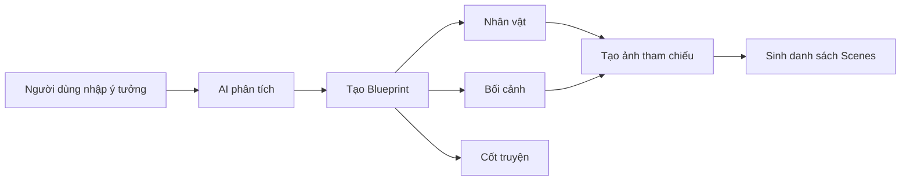
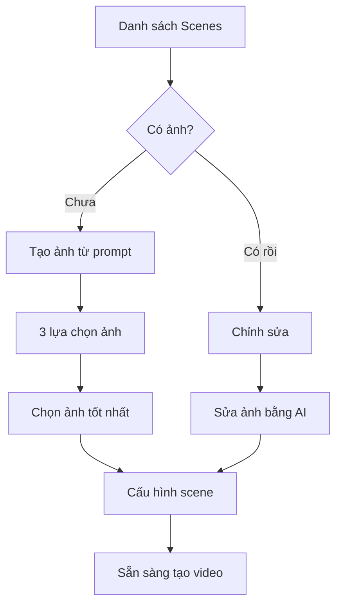
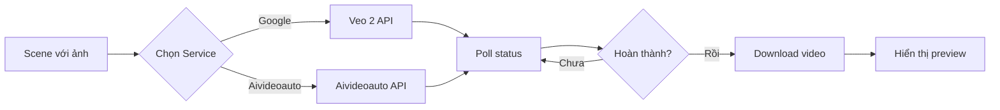

# 📽️ AI Storyboard - Tài Liệu Tổng Quan Dự Án

> **Phiên bản:** 2.8.1  
> **Ngày cập nhật:** 2025-01-15  
> **Tác giả:** AI Storyboard Team

---

## 📋 Mục Lục

1. [Giới Thiệu Dự Án](#giới-thiệu-dự-án)
2. [Kiến Trúc Hệ Thống](#kiến-trúc-hệ-thống)
3. [Luồng Hoạt Động Chính](#luồng-hoạt-động-chính)
4. [Các Thành Phần Chính](#các-thành-phần-chính)
5. [Tích Hợp API](#tích-hợp-api)
6. [Sơ Đồ Quy Trình](#sơ-đồ-quy-trình)

---

## 🎯 Giới Thiệu Dự Án

### Mô Tả

**AI Storyboard** là ứng dụng web tạo storyboard và video tự động bằng AI, giúp người dùng chuyển đổi ý tưởng thành video hoàn chỉnh chỉ trong vài bước đơn giản.

### Tính Năng Chính

| Tính Năng | Mô Tả | Công Nghệ |
|-----------|-------|-----------|
| 🎨 **Tạo Blueprint** | Phân tích ý tưởng thành nhân vật, bối cảnh, cốt truyện | Google Gemini AI |
| 🖼️ **Sinh Ảnh Tĩnh** | Tạo ảnh storyboard chất lượng cao | Google Imagen 4 / Aivideoauto |
| 🎬 **Tạo Video** | Chuyển ảnh tĩnh thành video động | Google Veo 2 / Aivideoauto |
| ✏️ **Chỉnh Sửa** | Sửa ảnh, thêm ghi chú đạo diễn | AI-powered editing |
| 📦 **Xuất File** | Tải về ZIP ảnh/video, export script | JSZip, File-saver |

### Công Nghệ Sử Dụng

```
Frontend:  React 18 + TypeScript + Vite
UI:        Tailwind CSS + Lucide Icons
State:     React Hooks (Custom)
API:       Google AI Studio + Aivideoauto
Build:     Vite 5.x
```

---

## 🏗️ Kiến Trúc Hệ Thống

### Sơ Đồ Tổng Quan

```
┌─────────────────────────────────────────────────────────────┐
│                        USER INTERFACE                        │
│  ┌─────────────┐  ┌─────────────┐  ┌─────────────┐         │
│  │   Ý Tưởng   │  │ Storyboard  │  │  Timeline   │         │
│  │   (Idea)    │→ │   (Edit)    │→ │  (Video)    │         │
│  └─────────────┘  └─────────────┘  └─────────────┘         │
└─────────────────────────────────────────────────────────────┘
                            ↓
┌─────────────────────────────────────────────────────────────┐
│                      BUSINESS LOGIC                          │
│  ┌──────────────────┐         ┌──────────────────┐          │
│  │  useStoryboard   │←───────→│   useApiConfig   │          │
│  │  (State + Logic) │         │  (API Settings)  │          │
│  └──────────────────┘         └──────────────────┘          │
└─────────────────────────────────────────────────────────────┘
                            ↓
┌─────────────────────────────────────────────────────────────┐
│                       API SERVICES                           │
│  ┌─────────────┐  ┌─────────────┐  ┌─────────────┐         │
│  │   Gemini    │  │     Veo     │  │ Aivideoauto │         │
│  │  (Ảnh+Text) │  │   (Video)   │  │ (Ảnh+Video) │         │
│  └─────────────┘  └─────────────┘  └─────────────┘         │
└─────────────────────────────────────────────────────────────┘
```

### Cấu Trúc Thư Mục

```
fix-dom-micheal---ai-storyboard-2.8-full-11-10_-ver-1.1fix/
├── components/          # UI Components
│   ├── settings/       # Cấu hình API, Settings
│   ├── storyboard/     # Editor, Timeline, Manager
│   └── ui/             # Button, Card, Modal, Input...
├── hooks/              # Custom React Hooks
│   ├── useApiConfig.ts # Quản lý API keys & models
│   └── useStoryboard.ts# Logic chính của app
├── services/           # API Integration Layer
│   ├── geminiService.ts# Google Gemini/Imagen
│   ├── veoService.ts   # Google Veo 2
│   └── aivideoautoService.ts # Aivideoauto
├── types/              # TypeScript Definitions
├── lib/                # Utilities (export, file, utils)
├── i18n/               # Đa ngôn ngữ (hiện tại: vi)
└── constants/          # Hằng số (shot types, transitions...)
```

---

## 🔄 Luồng Hoạt Động Chính

### 1️⃣ Giai Đoạn Ý Tưởng (Idea Phase)



**Chi tiết:**
- User nhập mô tả video (ví dụ: "Một cô gái đi dạo trong rừng mùa thu")
- Gọi `geminiService.generateBlueprintFromIdea()`
- AI trả về:
  - **Characters**: Danh sách nhân vật với mô tả chi tiết
  - **Locations**: Danh sách bối cảnh
  - **Story Outline**: Các điểm chính của cốt truyện
- Tự động tạo ảnh tham chiếu cho từng nhân vật/bối cảnh
- Sinh danh sách scenes dựa trên blueprint

### 2️⃣ Giai Đoạn Storyboard (Editing Phase)



**Chi tiết:**
- Mỗi scene có:
  - **Image Prompt**: Mô tả ảnh tĩnh (action + setting + shot type + style)
  - **Video Prompt**: Mô tả video động (camera movement + lighting + effects)
  - **Metadata**: Characters, locations, duration, transition
- User có thể:
  - Generate ảnh (3 options/scene)
  - Replace ảnh bằng upload
  - Edit ảnh với AI prompt
  - Reorder scenes (drag & drop)

### 3️⃣ Giai Đoạn Video (Timeline Phase)



**Chi tiết:**
- User chọn service trong Settings:
  - **Google**: Dùng Veo 2 (nhanh, 8s, 720p/1080p)
  - **Aivideoauto**: Dùng models của họ (linh hoạt hơn)
- Gọi API tạo video:
  - Gửi videoPrompt + mainImage
  - Poll trạng thái mỗi 10s
  - Cập nhật progress message
  - Tải video về khi xong
- Hiển thị video preview với play/pause
- Cho phép tải tất cả video về ZIP

---

## 🧩 Các Thành Phần Chính

### Hook: `useApiConfig`

**Chức năng:** Quản lý cấu hình API keys và models

```typescript
interface ApiConfig {
  // Service Selection
  service: 'google' | 'aivideoauto';
  setService: (service) => void;
  
  // Google Configuration
  googleApiKey: string;
  googleApiStatus: 'idle' | 'validating' | 'valid' | 'error' | 'env_configured';
  googleModel: string;           // Image model
  googleVideoModel: string;      // Video model (VEO 2)
  
  // Aivideoauto Configuration
  aivideoautoToken: string;
  aivideoautoStatus: 'idle' | 'validating' | 'valid' | 'error';
  aivideoautoModel: string;      // Image model
  aivideoautoVideoModel: string; // Video model
  aivideoautoModels: Model[];    // Available models
}
```

**Tính năng:**
- ✅ Validate API key/token
- ✅ Lưu vào localStorage
- ✅ Ưu tiên key từ .env.local
- ✅ Fetch danh sách models

### Hook: `useStoryboard`

**Chức năng:** Quản lý state và logic chính của app

```typescript
interface UseStoryboardReturn {
  // State
  scenes: Scene[];
  characters: Character[];
  locations: Location[];
  
  // Image Generation
  generateImageForScene: (index) => Promise<void>;
  editImageForScene: (index, prompt, refs) => Promise<void>;
  regenerateAllImages: () => Promise<void>;
  
  // Video Generation
  generateVideoForScene: (index) => Promise<void>;
  generateAllSceneVideos: () => Promise<void>;
  
  // Batch Operations
  batchProgress: BatchProgress | null;
  isBatchGenerating: boolean;
  
  // Export
  downloadAllSceneImages: () => void;
  downloadAllSceneVideos: () => void;
}
```

**Tính năng:**
- ✅ Quản lý scenes, characters, locations
- ✅ Generate ảnh/video với progress tracking
- ✅ Batch operations với ETA
- ✅ Busy state management
- ✅ Auto-sync prompts khi chỉnh sửa

### Service: `geminiService`

**API Endpoints:**
```
POST /v1beta/models/gemini-2.0-flash-exp:generateContent
POST /v1beta/models/imagen-4.0-generate-001:predict
POST /v1beta/models/gemini-2.5-flash-image-preview:editImage
```

**Chức năng:**
- 🎨 Generate blueprint từ ý tưởng
- 🖼️ Tạo ảnh từ prompt (với/không tham chiếu)
- ✏️ Chỉnh sửa ảnh với AI
- 📊 Phân tích ảnh upload để tạo metadata

### Service: `veoService`

**API Endpoints:**
```
POST /v1beta/models/veo-2.0-generate-001:generateVideos
GET  /v1beta/operations/{operationId}
```

**Chức năng:**
- 🎬 Tạo video 8s từ prompt + ảnh
- 🔄 Poll operation status
- 📥 Download video về blob URL
- ⚡ Retry logic với exponential backoff

### Service: `aivideoautoService`

**API Endpoints:**
```
POST /api/models (list models)
POST /api/generate (create task)
GET  /api/status/{taskId} (check status)
```

**Chức năng:**
- 🖼️ Tạo ảnh với nhiều models
- 🎬 Tạo video với nhiều models
- 📤 Upload ảnh tham chiếu
- 🔄 Poll task status với queue position

---

## 🔌 Tích Hợp API

### Google AI Studio

**Setup:**
```bash
# 1. Lấy API key từ https://aistudio.google.com
# 2. Thêm vào .env.local
API_KEY=AIzaSy...

# 3. Hoặc nhập trong Settings UI
```

**Models hỗ trợ:**
- **Imagen 4**: Tạo ảnh chất lượng cao
- **Gemini 2.5 Flash**: Chỉnh sửa ảnh + tham chiếu
- **Veo 2**: Tạo video 8s (720p/1080p)

**Rate Limits:**
- Free tier: 15 requests/minute
- Paid tier: 60 requests/minute

### Aivideoauto

**Setup:**
```bash
# 1. Đăng ký tại https://aivideoauto.com
# 2. Lấy access token từ account/apikeys
# 3. Nhập trong Settings UI
```

**Models hỗ trợ:**
- Image: flux-dev, flux-pro, stable-diffusion...
- Video: kling-1.6, runway-gen3...

---

## 📊 Sơ Đồ Quy Trình

### Quy Trình Tạo Video Hoàn Chỉnh

```
┌──────────────────────────────────────────────────────────┐
│ BƯỚC 1: NHẬP Ý TƯỞNG                                     │
├──────────────────────────────────────────────────────────┤
│ • User nhập mô tả video                                  │
│ • Chọn video style (cinematic/3d/pixar)                  │
│ • Chọn aspect ratio (16:9 / 9:16)                        │
│ • Chọn thời lượng (8s, 16s, 24s...)                      │
└──────────────────────────────────────────────────────────┘
                        ↓
┌──────────────────────────────────────────────────────────┐
│ BƯỚC 2: AI TẠO BLUEPRINT                                 │
├──────────────────────────────────────────────────────────┤
│ • Gọi Gemini API phân tích                               │
│ • Tạo danh sách Characters                               │
│ • Tạo danh sách Locations                                │
│ • Tạo Story Outline                                      │
│ • Auto-generate ảnh tham chiếu                           │
└──────────────────────────────────────────────────────────┘
                        ↓
┌──────────────────────────────────────────────────────────┐
│ BƯỚC 3: SINH SCENES                                      │
├──────────────────────────────────────────────────────────┤
│ • Tính số scenes = ceil(duration / 8)                    │
│ • Gọi Gemini tạo chi tiết từng scene                     │
│ • Map characters/locations vào scenes                    │
│ • Generate image prompt + video prompt                   │
└──────────────────────────────────────────────────────────┘
                        ↓
┌──────────────────────────────────────────────────────────┐
│ BƯỚC 4: TẠO ẢNH STORYBOARD                              │
├──────────────────────────────────────────────────────────┤
│ • User bấm "Generate All Images"                         │
│ • Batch generate: 3 options/scene                        │
│ • Show progress bar + ETA                                │
│ • User chọn ảnh đẹp nhất                                 │
│ • Có thể edit/replace ảnh                                │
└──────────────────────────────────────────────────────────┘
                        ↓
┌──────────────────────────────────────────────────────────┐
│ BƯỚC 5: TẠO VIDEO                                        │
├──────────────────────────────────────────────────────────┤
│ • User chọn service (Google Veo 2 / Aivideoauto)        │
│ • Bấm "Generate All Videos"                              │
│ • Batch generate với polling                             │
│ • Show progress + ETA                                    │
│ • Download videos về blob URL                            │
└──────────────────────────────────────────────────────────┘
                        ↓
┌──────────────────────────────────────────────────────────┐
│ BƯỚC 6: XUẤT KẾT QUẢ                                    │
├──────────────────────────────────────────────────────────┤
│ • Preview video trong timeline                           │
│ • Download All Images (ZIP)                              │
│ • Download All Videos (ZIP)                              │
│ • Export VEO script (TXT)                                │
└──────────────────────────────────────────────────────────┘
```

### Sơ Đồ Data Flow

```
User Input (Idea)
      ↓
[useStoryboard Hook]
      ↓
┌─────┴─────┐
│           │
↓           ↓
Generate    Generate
Blueprint   Scenes
│           │
↓           ↓
[Characters] [Scenes with prompts]
[Locations]  │
│            ↓
↓            Generate Images
Generate     (Gemini/Aivideoauto)
Reference    │
Images       ↓
│            [Scenes with images]
│            │
│            ↓
│            Generate Videos
│            (Veo 2/Aivideoauto)
│            │
└────────────┴───→ [Complete Storyboard]
                   │
                   ↓
                   Export (ZIP/Script)
```

---

## 🎨 UI/UX Flow

### Tab Navigation

```
┌────────────────────────────────────────────────────────┐
│  [✨ Ý Tưởng]  [🖼️ Storyboard]  [▶️ Timeline]        │
│     (active)      (disabled)      (disabled)          │
└────────────────────────────────────────────────────────┘
```

**Trạng thái tabs:**
- **Ý Tưởng**: Luôn active
- **Storyboard**: Enabled khi có characters/locations
- **Timeline**: Enabled khi có scenes

### Progress Indicators

```
Đang tạo ảnh tham chiếu... (3/5) ~2 phút còn lại
[████████████░░░░░░░░] 60%

Đang tạo video... (2/8) ~5 phút còn lại
[████░░░░░░░░░░░░░░░░] 25%
```

---

## 🔧 Cấu Hình & Môi Trường

### Environment Variables

```bash
# .env.local
API_KEY=AIzaSy...  # Google AI Studio API Key (optional)
```

### Package Dependencies

```json
{
  "dependencies": {
    "react": "^18.3.1",
    "@google/genai": "^0.21.0",
    "jszip": "^3.10.1",
    "file-saver": "^2.0.5",
    "lucide-react": "^0.468.0"
  }
}
```

### Browser Support

- Chrome 90+
- Firefox 88+
- Safari 14+
- Edge 90+

---

## 📈 Performance & Optimization

### Batch Processing

- **Image Generation**: 3 concurrent requests
- **Video Generation**: 1 at a time (để tránh rate limit)
- **Progress Tracking**: Real-time ETA calculation

### Caching Strategy

- API keys: localStorage
- Generated images: In-memory (React state)
- Videos: Blob URLs (tự động cleanup)

### Error Handling

- Retry logic với exponential backoff
- User-friendly error messages
- Graceful degradation

---

## 🚀 Roadmap

### Đã Hoàn Thành ✅
- [x] Tạo blueprint từ ý tưởng
- [x] Sinh ảnh storyboard
- [x] Tích hợp Aivideoauto video
- [x] Batch operations với progress
- [x] Export ZIP

### Đang Phát Triển 🚧
- [ ] Tích hợp Google Veo 2
- [ ] Chọn giữa nhiều video services
- [ ] Cải thiện UI/UX

### Kế Hoạch Tương Lai 🔮
- [ ] Hỗ trợ nhiều ngôn ngữ
- [ ] Cloud storage integration
- [ ] Collaborative editing
- [ ] Video editing timeline
- [ ] Audio/music integration

---

## 📞 Hỗ Trợ & Liên Hệ

**Documentation:** [docs/](./docs/)  
**Issues:** GitHub Issues  
**Email:** support@aistoryboard.com

---

**© 2025 AI Storyboard Team. All rights reserved.**

